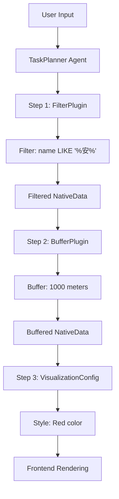
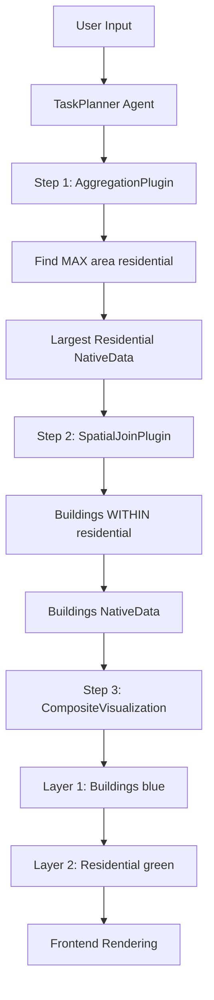

# Complex Natural Language Query Analysis - Gap Assessment

## Date: 2026-05-04

---

## Executive Summary

From an architect's perspective, I've analyzed two complex natural language queries to identify gaps in the current GeoAI-UP implementation. The analysis reveals **critical missing capabilities** in three areas:

1. **Accessor Layer**: Missing `filter()` and `query()` operations for attribute-based filtering
2. **Plugin System**: Missing FilterPlugin, MaxSelectionPlugin, and CompositeVisualizationPlugin
3. **LLM Context Injection**: Schema information IS provided but lacks detailed field types and sample values for complex decision-making

**Overall Assessment**: The platform can handle simple spatial operations (buffer, overlay) but cannot yet support complex multi-step queries involving attribute filtering, conditional selection, or composite visualization.

---

## Query Analysis

### Query 1: "把陕西省行政区划数据中名称带'安'的做缓冲区1000米用红色显示"

**Translation**: "Create a 1000-meter buffer around administrative divisions in Shaanxi Province whose names contain 'An', and display them in red."

**Required Operations**:
```
1. Filter: Select features where name LIKE '%安%'
2. Buffer: Create 1000m buffer around filtered features
3. Style: Apply red color for visualization
```

**Current Capability**: ❌ **CANNOT SUPPORT** - Missing filter operation

---

### Query 2: "把小区数据集中面积最大的小区包含的建筑物显示出来，把小区也显示出来"

**Translation**: "Display the buildings contained within the residential area with the largest area from the residential dataset, and also display the residential area itself."

**Required Operations**:
```
1. Aggregate: Find feature with MAX(area)
2. Spatial Join: Find buildings intersecting the selected residential area
3. Visualization: Display both buildings and residential area
```

**Current Capability**: ❌ **CANNOT SUPPORT** - Missing aggregation and spatial join operations

---

## Gap 1: Accessor Layer - Missing Filter/Query Operations

### Current State

**DataAccessor Interface** (`server/src/data-access/interfaces.ts`):
```typescript
export interface DataAccessor {
  // Basic CRUD
  read(reference: string): Promise<NativeData>;
  write(data: any, metadata?: Partial<DataMetadata>): Promise<string>;
  delete(reference: string): Promise<void>;
  getMetadata(reference: string): Promise<DataMetadata>;
  validate(reference: string): Promise<boolean>;
  
  // Spatial Operations
  buffer(reference: string, distance: number, options?: BufferOptions): Promise<NativeData>;
  overlay(reference1: string, reference2: string, options: OverlayOptions): Promise<NativeData>;
  
  // ❌ MISSING: Filter/Query operations
}
```

### Required Enhancement

**Add Filter Operation to DataAccessor Interface**:
```typescript
/**
 * Filter data based on attribute conditions
 * @param reference - Data source reference
 * @param filter - Filter conditions
 * @returns Promise resolving to NativeData with filtered result
 */
filter(reference: string, filter: FilterCondition): Promise<NativeData>;

/**
 * Execute custom query on data source
 * @param reference - Data source reference
 * @param query - Query expression (SQL-like or JSON)
 * @returns Promise resolving to NativeData with query result
 */
query(reference: string, query: QueryExpression): Promise<NativeData>;
```

**Filter Condition Type Definition**:
```typescript
export interface FilterCondition {
  /** Field name to filter on */
  field: string;
  
  /** Operator */
  operator: FilterOperator;
  
  /** Value to compare against */
  value: any;
  
  /** Logical connector to next condition */
  connector?: 'AND' | 'OR';
  
  /** Nested conditions for complex logic */
  conditions?: FilterCondition[];
}

export type FilterOperator = 
  | 'equals'           // =
  | 'not_equals'       // !=
  | 'greater_than'     // >
  | 'less_than'        // <
  | 'greater_equal'    // >=
  | 'less_equal'       // <=
  | 'contains'         // LIKE '%value%'
  | 'starts_with'      // LIKE 'value%'
  | 'ends_with'        // LIKE '%value'
  | 'in'               // IN (val1, val2, ...)
  | 'between'          // BETWEEN val1 AND val2
  | 'is_null'          // IS NULL
  | 'is_not_null';     // IS NOT NULL
```

**Query Expression Type Definition**:
```typescript
export interface QueryExpression {
  /** Query type */
  type: 'sql' | 'json' | 'aggregate';
  
  /** SQL query string (for PostGIS) */
  sql?: string;
  
  /** JSON query object (for GeoJSON/Shapefile) */
  json?: {
    where?: FilterCondition;
    select?: string[];
    orderBy?: { field: string; direction: 'ASC' | 'DESC' }[];
    limit?: number;
    offset?: number;
  };
  
  /** Aggregate query */
  aggregate?: {
    function: 'MAX' | 'MIN' | 'SUM' | 'AVG' | 'COUNT';
    field: string;
    groupBy?: string[];
  };
}
```

---

### Implementation Plan by Accessor Type

#### **1. PostGISAccessor.filter()** - HIGH PRIORITY

**Implementation Strategy**: Use PostgreSQL WHERE clause with parameterized queries

```typescript
async filter(reference: string, filter: FilterCondition): Promise<NativeData> {
  const pool = this.getPool();
  const schema = this.config.schema || 'public';
  const tableName = reference.split('.').pop() || reference;
  
  // Build WHERE clause from filter condition
  const { whereClause, params } = this.buildWhereClause(filter);
  
  // Execute filtered query
  const query = `
    SELECT *, ST_AsGeoJSON(geom) as geometry
    FROM ${schema}.${tableName}
    WHERE ${whereClause}
  `;
  
  const result = await pool.query(query, params);
  
  // Convert to GeoJSON FeatureCollection
  const geojson: GeoJSON.FeatureCollection = {
    type: 'FeatureCollection',
    features: result.rows.map((row: any) => ({
      type: 'Feature',
      geometry: JSON.parse(row.geometry),
      properties: this.extractProperties(row)
    }))
  };
  
  // Save filtered result as temporary GeoJSON
  const resultPath = path.join(this.workspaceBase, 'temp', `filtered_${Date.now()}.geojson`);
  fs.writeFileSync(resultPath, JSON.stringify(geojson));
  
  return {
    id: generateId(),
    type: 'geojson',
    reference: resultPath,
    metadata: {
      featureCount: geojson.features.length,
      crs: 'EPSG:4326',
      bbox: this.calculateBbox(geojson),
      filterApplied: this.serializeFilter(filter)
    },
    createdAt: new Date()
  };
}

private buildWhereClause(filter: FilterCondition): { whereClause: string; params: any[] } {
  const params: any[] = [];
  let paramIndex = 1;
  
  const buildCondition = (cond: FilterCondition): string => {
    if (cond.conditions && cond.conditions.length > 0) {
      // Handle nested conditions
      const subConditions = cond.conditions.map(buildCondition).join(` ${cond.connector || 'AND'} `);
      return `(${subConditions})`;
    }
    
    switch (cond.operator) {
      case 'equals':
        params.push(cond.value);
        return `${cond.field} = $${paramIndex++}`;
      
      case 'contains':
        params.push(`%${cond.value}%`);
        return `${cond.field} ILIKE $${paramIndex++}`;
      
      case 'greater_than':
        params.push(cond.value);
        return `${cond.field} > $${paramIndex++}`;
      
      case 'in':
        const placeholders = cond.value.map(() => `$${paramIndex++}`).join(', ');
        params.push(...cond.value);
        return `${cond.field} IN (${placeholders})`;
      
      default:
        throw new Error(`Unsupported operator: ${cond.operator}`);
    }
  };
  
  const whereClause = buildCondition(filter);
  return { whereClause, params };
}
```

**Example Usage for Query 1**:
```typescript
// User says: "名称带'安'的"
const filter: FilterCondition = {
  field: 'name',
  operator: 'contains',
  value: '安'
};

const filtered = await postgisAccessor.filter('shaanxi_admin', filter);
// Result: Only features where name LIKE '%安%'
```

---

#### **2. GeoJSONAccessor.filter()** - MEDIUM PRIORITY

**Implementation Strategy**: Use JavaScript array filtering on parsed GeoJSON

```typescript
async filter(reference: string, filter: FilterCondition): Promise<NativeData> {
  // Read GeoJSON file
  const content = fs.readFileSync(reference, 'utf-8');
  const geojson: GeoJSON.FeatureCollection = JSON.parse(content);
  
  // Filter features based on condition
  const filteredFeatures = geojson.features.filter(feature => {
    return this.evaluateCondition(feature.properties, filter);
  });
  
  // Create filtered GeoJSON
  const result: GeoJSON.FeatureCollection = {
    type: 'FeatureCollection',
    features: filteredFeatures
  };
  
  // Save result
  const resultPath = path.join(this.workspaceBase, 'temp', `filtered_${Date.now()}.geojson`);
  fs.writeFileSync(resultPath, JSON.stringify(result));
  
  return {
    id: generateId(),
    type: 'geojson',
    reference: resultPath,
    metadata: {
      featureCount: filteredFeatures.length,
      crs: geojson.crs?.properties?.name || 'EPSG:4326',
      bbox: this.calculateBbox(result),
      filterApplied: this.serializeFilter(filter)
    },
    createdAt: new Date()
  };
}

private evaluateCondition(properties: any, condition: FilterCondition): boolean {
  if (condition.conditions && condition.conditions.length > 0) {
    // Handle nested conditions
    const results = condition.conditions.map(cond => 
      this.evaluateCondition(properties, cond)
    );
    
    const connector = condition.connector || 'AND';
    return connector === 'AND' 
      ? results.every(r => r)
      : results.some(r => r);
  }
  
  const fieldValue = properties[condition.field];
  
  switch (condition.operator) {
    case 'equals':
      return fieldValue === condition.value;
    
    case 'contains':
      return String(fieldValue).includes(condition.value);
    
    case 'greater_than':
      return Number(fieldValue) > Number(condition.value);
    
    case 'in':
      return condition.value.includes(fieldValue);
    
    default:
      throw new Error(`Unsupported operator: ${condition.operator}`);
  }
}
```

---

#### **3. ShapefileAccessor.filter()** - MEDIUM PRIORITY

**Implementation Strategy**: Convert to GeoJSON, filter, save as GeoJSON

```typescript
async filter(reference: string, filter: FilterCondition): Promise<NativeData> {
  // Step 1: Convert Shapefile to GeoJSON
  const baseName = path.basename(reference, '.shp');
  const source = await shapefile.open(reference.replace('.shp', ''));
  const collection = await source.read();
  
  // Step 2: Filter features
  const filteredFeatures = collection.features.filter(feature => {
    return this.evaluateCondition(feature.properties, filter);
  });
  
  // Step 3: Create filtered GeoJSON
  const result: GeoJSON.FeatureCollection = {
    type: 'FeatureCollection',
    features: filteredFeatures
  };
  
  // Step 4: Save result
  const resultPath = path.join(this.workspaceBase, 'temp', `filtered_${baseName}_${Date.now()}.geojson`);
  fs.writeFileSync(resultPath, JSON.stringify(result));
  
  return {
    id: generateId(),
    type: 'geojson',
    reference: resultPath,
    metadata: {
      featureCount: filteredFeatures.length,
      crs: 'EPSG:4326',
      bbox: this.calculateBbox(result),
      filterApplied: this.serializeFilter(filter)
    },
    createdAt: new Date()
  };
}
```

---

## Gap 2: Missing Plugins for Complex Queries

### Plugin Inventory - Current State

**Existing Plugins**:
- ✅ BufferAnalysisPlugin - Buffer operation
- ✅ OverlayAnalysisPlugin - Spatial overlay (intersect, union, difference)
- ✅ StatisticsCalculatorPlugin - Statistical calculations
- ✅ HeatmapPlugin - Kernel density estimation
- ✅ ReportGeneratorPlugin - HTML report generation

**Missing Critical Plugins**:

---

### **Plugin 1: FilterPlugin** - HIGH PRIORITY

**Purpose**: Apply attribute-based filters to data sources

**Plugin Definition**:
```typescript
export const FilterPlugin: Plugin = {
  id: 'data_filter',
  name: 'Data Filter',
  version: '1.0.0',
  description: 'Filter data sources based on attribute conditions',
  category: 'analysis',
  inputSchema: [
    {
      name: 'dataSourceId',
      type: 'data_reference',
      required: true,
      description: 'ID of the data source to filter'
    },
    {
      name: 'field',
      type: 'string',
      required: true,
      description: 'Field name to filter on'
    },
    {
      name: 'operator',
      type: 'string',
      required: true,
      defaultValue: 'equals',
      validation: {
        enum: ['equals', 'not_equals', 'greater_than', 'less_than', 
               'contains', 'starts_with', 'ends_with', 'in', 'between']
      },
      description: 'Comparison operator'
    },
    {
      name: 'value',
      type: 'any',
      required: true,
      description: 'Value to compare against'
    },
    {
      name: 'connector',
      type: 'string',
      required: false,
      defaultValue: 'AND',
      validation: {
        enum: ['AND', 'OR']
      },
      description: 'Logical connector for multiple conditions'
    },
    {
      name: 'conditions',
      type: 'array',
      required: false,
      description: 'Nested conditions for complex filtering'
    }
  ],
  outputSchema: {
    type: 'native_data',
    description: 'Filtered data as NativeData reference'
  },
  capabilities: ['data_filtering', 'attribute_query'],
  isBuiltin: true,
  installedAt: new Date()
};
```

**Executor Implementation**:
```typescript
export class FilterExecutor implements PluginExecutor {
  constructor(
    private dataSourceRepo: DataSourceRepository,
    private accessorFactory: DataAccessorFactory
  ) {}

  async execute(params: Record<string, any>): Promise<NativeData> {
    const { dataSourceId, field, operator, value, connector, conditions } = params;
    
    // Get data source
    const dataSource = this.dataSourceRepo.getById(dataSourceId);
    if (!dataSource) {
      throw new Error(`Data source not found: ${dataSourceId}`);
    }
    
    // Create appropriate accessor
    const accessor = this.accessorFactory.createAccessor(dataSource.type);
    
    // Build filter condition
    const filter: FilterCondition = {
      field,
      operator: operator as FilterOperator,
      value,
      connector: connector as 'AND' | 'OR',
      conditions: conditions as FilterCondition[] | undefined
    };
    
    // Execute filter
    return await accessor.filter(dataSource.reference, filter);
  }
}
```

**Usage for Query 1**:
```typescript
// LLM generates this execution plan:
{
  pluginId: 'data_filter',
  params: {
    dataSourceId: 'shaanxi_admin_1777827645032',
    field: 'name',
    operator: 'contains',
    value: '安'
  }
}
→ Returns filtered NativeData with only "安" features
```

---

### **Plugin 2: AggregationPlugin** - HIGH PRIORITY

**Purpose**: Perform aggregate operations (MAX, MIN, SUM, AVG, COUNT) on data

**Plugin Definition**:
```typescript
export const AggregationPlugin: Plugin = {
  id: 'data_aggregation',
  name: 'Data Aggregation',
  version: '1.0.0',
  description: 'Perform aggregate operations on data source fields',
  category: 'analysis',
  inputSchema: [
    {
      name: 'dataSourceId',
      type: 'data_reference',
      required: true,
      description: 'ID of the data source'
    },
    {
      name: 'function',
      type: 'string',
      required: true,
      validation: {
        enum: ['MAX', 'MIN', 'SUM', 'AVG', 'COUNT']
      },
      description: 'Aggregate function to apply'
    },
    {
      name: 'field',
      type: 'string',
      required: true,
      description: 'Field to aggregate'
    },
    {
      name: 'groupBy',
      type: 'array',
      required: false,
      description: 'Fields to group by'
    },
    {
      name: 'returnFeature',
      type: 'boolean',
      required: false,
      defaultValue: false,
      description: 'Return the feature with max/min value instead of just the value'
    }
  ],
  outputSchema: {
    type: 'native_data',
    description: 'Aggregated result or feature with extreme value'
  },
  capabilities: ['aggregation', 'statistics'],
  isBuiltin: true,
  installedAt: new Date()
};
```

**Executor Implementation**:
```typescript
export class AggregationExecutor implements PluginExecutor {
  async execute(params: Record<string, any>): Promise<NativeData> {
    const { dataSourceId, function: aggFunc, field, groupBy, returnFeature } = params;
    
    const dataSource = this.dataSourceRepo.getById(dataSourceId);
    const accessor = this.accessorFactory.createAccessor(dataSource.type);
    
    if (dataSource.type === 'postgis') {
      // Use SQL aggregation for PostGIS
      return await this.executePostGISAggregation(accessor, dataSource, aggFunc, field, returnFeature);
    } else {
      // Use JavaScript aggregation for GeoJSON/Shapefile
      return await this.executeGeoJSONAggregation(accessor, dataSource, aggFunc, field, returnFeature);
    }
  }
  
  private async executePostGISAggregation(
    accessor: any,
    dataSource: any,
    aggFunc: string,
    field: string,
    returnFeature: boolean
  ): Promise<NativeData> {
    const schema = dataSource.metadata?.schema || 'public';
    const tableName = dataSource.reference.split('.').pop();
    
    if (returnFeature && (aggFunc === 'MAX' || aggFunc === 'MIN')) {
      // Return the feature with max/min value
      const order = aggFunc === 'MAX' ? 'DESC' : 'ASC';
      const query = `
        SELECT *, ST_AsGeoJSON(geom) as geometry
        FROM ${schema}.${tableName}
        ORDER BY ${field} ${order}
        LIMIT 1
      `;
      
      const result = await accessor.executeRaw(query);
      const row = result.rows[0];
      
      // Convert to GeoJSON and save
      const geojson = {
        type: 'FeatureCollection',
        features: [{
          type: 'Feature',
          geometry: JSON.parse(row.geometry),
          properties: this.extractProperties(row)
        }]
      };
      
      const resultPath = this.saveResult(geojson);
      
      return {
        id: generateId(),
        type: 'geojson',
        reference: resultPath,
        metadata: {
          featureCount: 1,
          aggregatedField: field,
          aggregatedFunction: aggFunc,
          aggregatedValue: row[field]
        },
        createdAt: new Date()
      };
    } else {
      // Just return aggregate value
      const query = `SELECT ${aggFunc}(${field}) as result FROM ${schema}.${tableName}`;
      const result = await accessor.executeRaw(query);
      
      return {
        id: generateId(),
        type: 'scalar',
        reference: null,
        metadata: {
          aggregatedField: field,
          aggregatedFunction: aggFunc,
          aggregatedValue: result.rows[0].result
        },
        createdAt: new Date()
      };
    }
  }
}
```

**Usage for Query 2**:
```typescript
// LLM generates this execution plan:
{
  pluginId: 'data_aggregation',
  params: {
    dataSourceId: 'residential_areas_1777827645032',
    function: 'MAX',
    field: 'area',
    returnFeature: true  // Return the actual feature, not just the value
  }
}
→ Returns NativeData with the residential area that has the largest area
```

---

### **Plugin 3: SpatialJoinPlugin** - MEDIUM PRIORITY

**Purpose**: Perform spatial joins between two datasets (e.g., find buildings within a polygon)

**Plugin Definition**:
```typescript
export const SpatialJoinPlugin: Plugin = {
  id: 'spatial_join',
  name: 'Spatial Join',
  version: '1.0.0',
  description: 'Join two datasets based on spatial relationships',
  category: 'analysis',
  inputSchema: [
    {
      name: 'targetDataSourceId',
      type: 'data_reference',
      required: true,
      description: 'ID of the target data source (e.g., buildings)'
    },
    {
      name: 'joinDataSourceId',
      type: 'data_reference',
      required: true,
      description: 'ID of the join data source (e.g., residential area)'
    },
    {
      name: 'operation',
      type: 'string',
      required: true,
      defaultValue: 'intersects',
      validation: {
        enum: ['intersects', 'contains', 'within', 'touches', 'crosses', 'overlaps']
      },
      description: 'Spatial relationship operation'
    },
    {
      name: 'joinType',
      type: 'string',
      required: false,
      defaultValue: 'inner',
      validation: {
        enum: ['inner', 'left', 'right']
      },
      description: 'Type of join'
    }
  ],
  outputSchema: {
    type: 'native_data',
    description: 'Joined data as NativeData reference'
  },
  capabilities: ['spatial_join', 'spatial_relationship'],
  isBuiltin: true,
  installedAt: new Date()
};
```

**Executor Implementation**:
```typescript
export class SpatialJoinExecutor implements PluginExecutor {
  async execute(params: Record<string, any>): Promise<NativeData> {
    const { targetDataSourceId, joinDataSourceId, operation, joinType } = params;
    
    const targetDS = this.dataSourceRepo.getById(targetDataSourceId);
    const joinDS = this.dataSourceRepo.getById(joinDataSourceId);
    
    if (targetDS.type === 'postgis' && joinDS.type === 'postgis') {
      return await this.executePostGISSpatialJoin(targetDS, joinDS, operation);
    } else {
      return await this.executeGeoJSONSpatialJoin(targetDS, joinDS, operation);
    }
  }
  
  private async executePostGISSpatialJoin(
    targetDS: any,
    joinDS: any,
    operation: string
  ): Promise<NativeData> {
    const accessor = this.accessorFactory.createAccessor('postgis') as any;
    
    const targetTable = targetDS.reference.split('.').pop();
    const joinTable = joinDS.reference.split('.').pop();
    const schema = targetDS.metadata?.schema || 'public';
    
    // Map operation to PostGIS function
    const spatialFunc = this.mapOperationToPostGIS(operation);
    
    const query = `
      SELECT t.*, ST_AsGeoJSON(t.geom) as geometry
      FROM ${schema}.${targetTable} t
      INNER JOIN ${schema}.${joinTable} j
      ON ST_${spatialFunc}(t.geom, j.geom)
    `;
    
    const result = await accessor.executeRaw(query);
    
    // Convert to GeoJSON and save
    const geojson = this.rowsToGeoJSON(result.rows);
    const resultPath = this.saveResult(geojson);
    
    return {
      id: generateId(),
      type: 'geojson',
      reference: resultPath,
      metadata: {
        featureCount: geojson.features.length,
        spatialJoin: {
          operation,
          targetTable,
          joinTable
        }
      },
      createdAt: new Date()
    };
  }
  
  private mapOperationToPostGIS(operation: string): string {
    const mapping: Record<string, string> = {
      'intersects': 'Intersects',
      'contains': 'Contains',
      'within': 'Within',
      'touches': 'Touches',
      'crosses': 'Crosses',
      'overlaps': 'Overlaps'
    };
    return mapping[operation] || 'Intersects';
  }
}
```

**Usage for Query 2**:
```typescript
// After finding the largest residential area, LLM generates:
{
  pluginId: 'spatial_join',
  params: {
    targetDataSourceId: 'buildings_1777827645032',
    joinDataSourceId: 'largest_residential_area_result_id',
    operation: 'within'  // Buildings within the residential area
  }
}
→ Returns NativeData with buildings inside the largest residential area
```

---

### **Plugin 4: CompositeVisualizationPlugin** - LOW PRIORITY

**Purpose**: Combine multiple data sources for unified visualization with styling

**Plugin Definition**:
```typescript
export const CompositeVisualizationPlugin: Plugin = {
  id: 'composite_visualization',
  name: 'Composite Visualization',
  version: '1.0.0',
  description: 'Combine multiple data sources for visualization with custom styling',
  category: 'visualization',
  inputSchema: [
    {
      name: 'layers',
      type: 'array',
      required: true,
      description: 'Array of layer configurations',
      items: {
        dataSourceId: 'string',
        style: {
          color: 'string',
          fillColor: 'string',
          opacity: 'number',
          strokeWidth: 'number'
        },
        label: 'string'
      }
    }
  ],
  outputSchema: {
    type: 'visualization_config',
    description: 'Configuration for multi-layer visualization'
  },
  capabilities: ['multi_layer_visualization', 'styling'],
  isBuiltin: true,
  installedAt: new Date()
};
```

---

## Gap 3: LLM Context Injection - Schema Information Status

### Current State - What IS Provided

**TaskPlannerAgent.formatDataSourcesForLLM()** provides:

✅ **For PostGIS**:
```
Available Data Sources (1):

- ID: shaanxi_admin_1777827645032
  Name: 陕西省行政区划
  Type: postgis
  Description: Administrative divisions of Shaanxi Province
  Table: shaanxi_admin
  Geometry: MultiPolygon (SRID: 4326)
  Rows: 107
  Numeric Fields: population, area, gdp
  Text Fields: name, code, province
```

✅ **For GeoJSON/Shapefile**:
```
- ID: residential_1777827645032
  Name: 小区数据.geojson
  Type: geojson
  File: 小区数据.geojson
  Geometry: Polygon
  Features: 1,234
  Fields: id (text), name (text), area (numeric), population (numeric), building_count (numeric)
```

### What's MISSING for Complex Queries

❌ **Detailed Field Types**: No data type information (integer vs float vs varchar)
❌ **Sample Values**: No example values to help LLM understand data semantics
❌ **Field Constraints**: No min/max ranges, no nullable info
❌ **Relationships**: No foreign key or spatial relationship hints
❌ **Indexes**: No performance hints for query optimization

### Enhanced Schema Injection Proposal

**Improved formatDataSourcesForLLM()**:
```typescript
private formatDataSourcesForLLM(dataSources: any[]): string {
  const formatted = dataSources.map(ds => {
    const lines = [
      `- ID: ${ds.id}`,
      `  Name: ${ds.name}`,
      `  Type: ${ds.type}`,
      `  Description: ${ds.metadata?.description || 'No description'}`
    ];
    
    if (ds.type === 'postgis') {
      lines.push(`  Table: ${ds.reference?.split('/').pop() || 'unknown'}`);
      lines.push(`  Geometry: ${ds.metadata?.geometryType || 'Unknown'} (SRID: ${ds.metadata?.srid || 'unknown'})`);
      lines.push(`  Rows: ${ds.metadata?.rowCount?.toLocaleString() || 'unknown'}`);
      
      // ✅ ENHANCED: Detailed field information with samples
      if (ds.metadata?.fields && Array.isArray(ds.metadata.fields)) {
        lines.push(`  Schema:`);
        
        ds.metadata.fields.forEach((field: any) => {
          const sampleInfo = ds.metadata.sampleValues?.[field.columnName];
          const sampleStr = sampleInfo 
            ? ` (sample: ${sampleInfo.example}, range: ${sampleInfo.min}-${sampleInfo.max})`
            : '';
          
          lines.push(`    - ${field.columnName}: ${field.dataType}${sampleStr}`);
        });
      }
      
      // ✅ NEW: Index information
      if (ds.metadata?.indexes && ds.metadata.indexes.length > 0) {
        const indexedFields = ds.metadata.indexes.map((idx: any) => idx.columns.join(', ')).join(', ');
        lines.push(`  Indexed Fields: ${indexedFields}`);
      }
      
      // ✅ NEW: Spatial relationship hints
      if (ds.metadata?.spatialRelationships) {
        lines.push(`  Spatial Relationships:`);
        ds.metadata.spatialRelationships.forEach((rel: any) => {
          lines.push(`    - ${rel.relatedTable}: ${rel.relationship} via ${rel.foreignKey}`);
        });
      }
    }
    
    return lines.join('\n');
  }).join('\n\n');

  return `Available Data Sources (${dataSources.length}):\n\n${formatted}`;
}
```

**Enhanced Output Example**:
```
Available Data Sources (2):

- ID: shaanxi_admin_1777827645032
  Name: 陕西省行政区划
  Type: postgis
  Description: Administrative divisions of Shaanxi Province
  Table: shaanxi_admin
  Geometry: MultiPolygon (SRID: 4326)
  Rows: 107
  Schema:
    - id: integer (sample: 1, range: 1-107)
    - name: varchar(100) (sample: "西安市", length: 3-10)
    - code: varchar(20) (sample: "610100")
    - area: numeric (sample: 9983.5, range: 125.3-20560.8)
    - population: integer (sample: 12000000, range: 50000-12000000)
    - geom: geometry(MultiPolygon, 4326)
  Indexed Fields: name, code

- ID: residential_1777827645032
  Name: 小区数据.geojson
  Type: geojson
  File: 小区数据.geojson
  Geometry: Polygon
  Features: 1,234
  Schema:
    - id: string (sample: "RES001")
    - name: string (sample: "阳光花园", length: 2-20)
    - area: numeric (sample: 50000.5, range: 1000-500000)
    - population: numeric (sample: 2500, range: 100-10000)
    - building_count: numeric (sample: 15, range: 1-50)
```

---

## Complete Execution Flow for Both Queries

### Query 1: "把陕西省行政区划数据中名称带'安'的做缓冲区1000米用红色显示"

**Required Execution Plan**:


**LLM-Generated Plan**:
```json
{
  "executionPlans": [
    {
      "goalId": "buffer_filtered_admin",
      "steps": [
        {
          "stepId": "step_1",
          "pluginId": "data_filter",
          "params": {
            "dataSourceId": "shaanxi_admin_1777827645032",
            "field": "name",
            "operator": "contains",
            "value": "安"
          }
        },
        {
          "stepId": "step_2",
          "pluginId": "buffer_analysis",
          "params": {
            "dataSourceId": "step_1_result",
            "distance": 1000,
            "unit": "meters",
            "dissolve": false
          }
        },
        {
          "stepId": "step_3",
          "pluginId": "visualization_config",
          "params": {
            "dataSourceId": "step_2_result",
            "style": {
              "fillColor": "#FF0000",
              "strokeColor": "#FF0000",
              "opacity": 0.6
            }
          }
        }
      ]
    }
  ]
}
```

**Current Support**: ❌ **BLOCKED** at Step 1 (FilterPlugin missing)

---

### Query 2: "把小区数据集中面积最大的小区包含的建筑物显示出来，把小区也显示出来"

**Required Execution Plan**:


**LLM-Generated Plan**:
```json
{
  "executionPlans": [
    {
      "goalId": "display_buildings_in_largest_residential",
      "steps": [
        {
          "stepId": "step_1",
          "pluginId": "data_aggregation",
          "params": {
            "dataSourceId": "residential_areas_1777827645032",
            "function": "MAX",
            "field": "area",
            "returnFeature": true
          }
        },
        {
          "stepId": "step_2",
          "pluginId": "spatial_join",
          "params": {
            "targetDataSourceId": "buildings_1777827645032",
            "joinDataSourceId": "step_1_result",
            "operation": "within"
          }
        },
        {
          "stepId": "step_3",
          "pluginId": "composite_visualization",
          "params": {
            "layers": [
              {
                "dataSourceId": "step_2_result",
                "style": {
                  "fillColor": "#0000FF",
                  "opacity": 0.7
                },
                "label": "Buildings"
              },
              {
                "dataSourceId": "step_1_result",
                "style": {
                  "fillColor": "#00FF00",
                  "opacity": 0.3,
                  "strokeWidth": 2
                },
                "label": "Largest Residential Area"
              }
            ]
          }
        }
      ]
    }
  ]
}
```

**Current Support**: ❌ **BLOCKED** at Step 1 (AggregationPlugin missing)

---

## Implementation Priority & Effort Estimate

### Phase 1: Enable Query 1 (High Priority)

| Component | Task | Lines | Effort |
|-----------|------|-------|--------|
| **DataAccessor Interface** | Add filter() method signature | +30 | 0.5h |
| **PostGISAccessor** | Implement filter() with SQL WHERE | +120 | 2h |
| **GeoJSONAccessor** | Implement filter() with JS filtering | +80 | 1.5h |
| **ShapefileAccessor** | Implement filter() via conversion | +60 | 1h |
| **FilterPlugin** | Plugin definition + executor | +150 | 2h |
| **Tests** | Unit tests for filter operations | +100 | 1.5h |
| **Total** | | **540 lines** | **8.5 hours** |

---

### Phase 2: Enable Query 2 (High Priority)

| Component | Task | Lines | Effort |
|-----------|------|-------|--------|
| **DataAccessor Interface** | Add query() method signature | +40 | 0.5h |
| **PostGISAccessor** | Implement aggregate queries | +100 | 2h |
| **GeoJSONAccessor** | Implement aggregate queries | +80 | 1.5h |
| **AggregationPlugin** | Plugin definition + executor | +180 | 2.5h |
| **SpatialJoinPlugin** | Plugin definition + executor | +200 | 3h |
| **Tests** | Unit tests for aggregation/join | +120 | 2h |
| **Total** | | **720 lines** | **11.5 hours** |

---

### Phase 3: Enhanced LLM Context (Medium Priority)

| Component | Task | Lines | Effort |
|-----------|------|-------|--------|
| **DataSourceService** | Enhance schema discovery with samples | +80 | 1.5h |
| **TaskPlannerAgent** | Improve formatDataSourcesForLLM() | +60 | 1h |
| **Tests** | Verify enhanced context injection | +50 | 1h |
| **Total** | | **190 lines** | **3.5 hours** |

---

### Phase 4: Composite Visualization (Low Priority)

| Component | Task | Lines | Effort |
|-----------|------|-------|--------|
| **CompositeVisualizationPlugin** | Plugin definition + executor | +150 | 2h |
| **Frontend Integration** | Multi-layer rendering support | TBD | 4h |
| **Total** | | **150+ lines** | **6+ hours** |

---

## Conclusion

From an architect's perspective, the GeoAI-UP platform has a solid foundation for basic spatial operations but requires **significant enhancements** to support complex natural language queries involving:

1. **Attribute Filtering** - Critical gap blocking Query 1
2. **Aggregation & Spatial Joins** - Critical gap blocking Query 2
3. **Enhanced Schema Context** - Important for LLM decision quality

**Immediate Next Steps**:
1. Implement FilterPlugin + accessor.filter() methods (Phase 1 - 8.5 hours)
2. Implement AggregationPlugin + SpatialJoinPlugin (Phase 2 - 11.5 hours)
3. Enhance LLM context with detailed schema information (Phase 3 - 3.5 hours)

**Total Estimated Effort**: **23.5 hours** to fully support both complex queries.

The architectural patterns are well-established (service layer, dependency injection, strategy pattern), so these additions will integrate cleanly with existing code.
