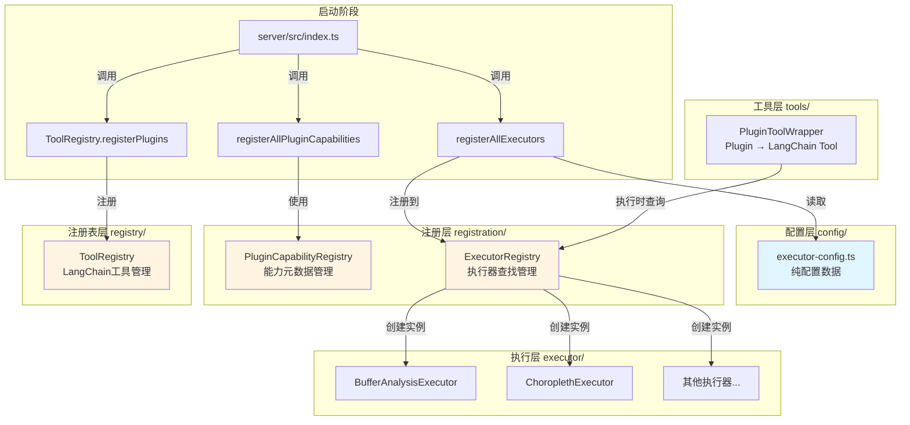
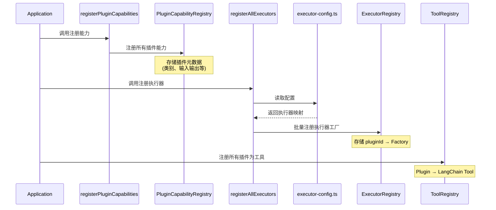
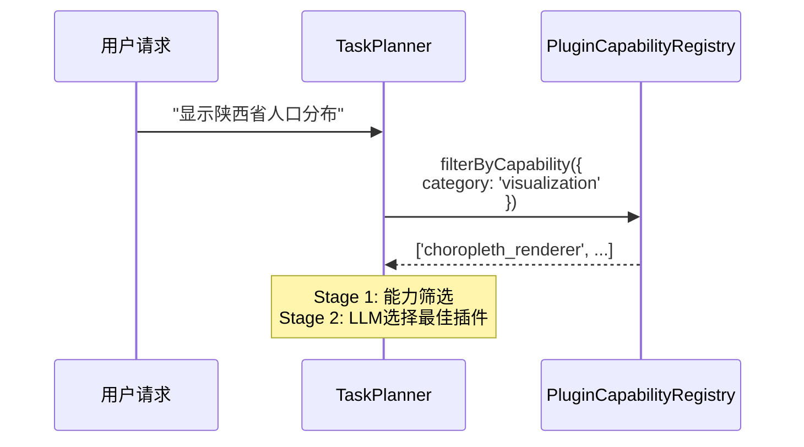
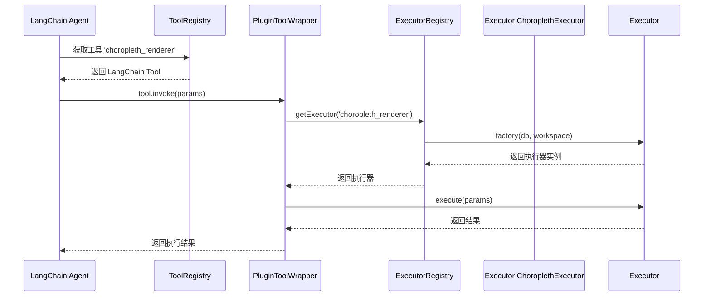
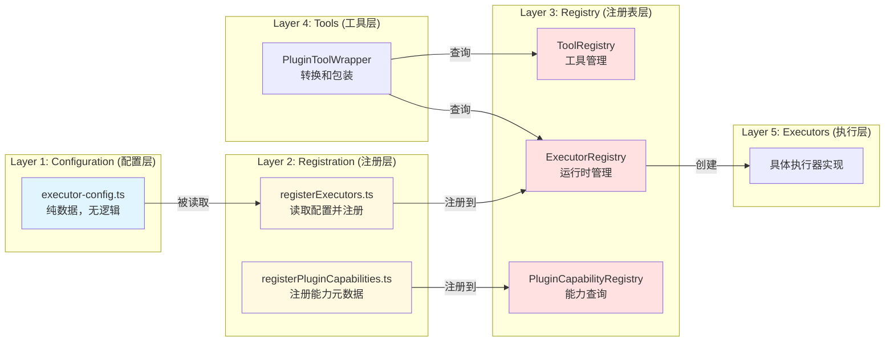
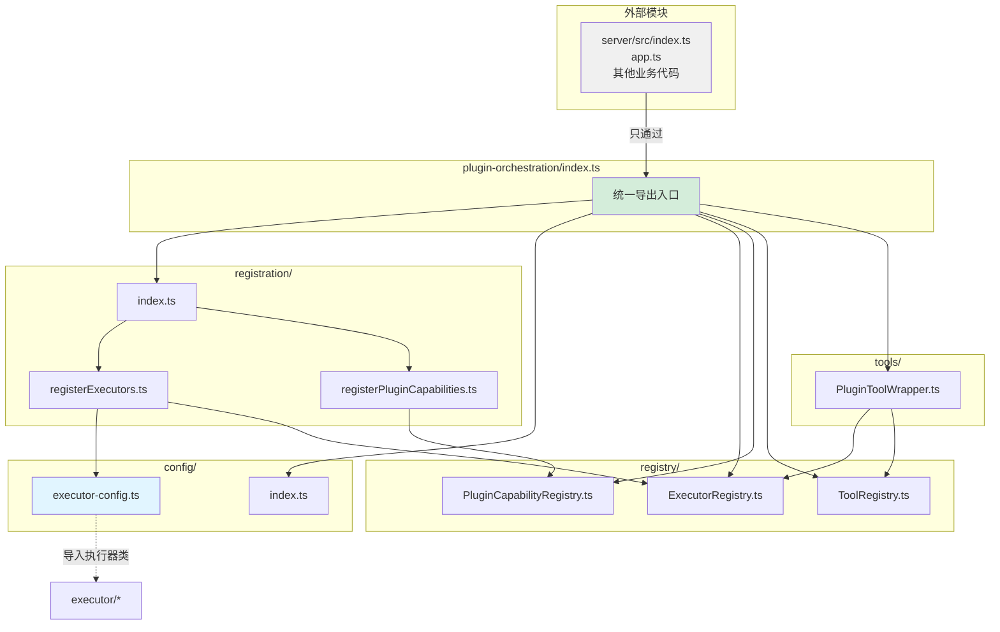

# Plugin Orchestration 架构关系图

## 📊 整体架构



---

## 🔄 工作流程

### 1. 启动阶段（Initialization）



### 2. 规划阶段（Planning）



### 3. 执行阶段（Execution）



---

## 🏗️ 分层架构



---

## 📦 模块依赖关系



---

## 🔑 关键设计模式

### 1. **单例模式 (Singleton)**
```typescript
// 三个注册表都使用单例模式
ExecutorRegistry.getInstance()
PluginCapabilityRegistry (静态方法)
ToolRegistry.getInstance()
```

### 2. **工厂模式 (Factory)**
```typescript
// ExecutorRegistry 存储工厂函数
type ExecutorFactory = (db, workspaceBase) => IPluginExecutor;

// 使用时创建实例
const executor = factory(db, workspaceBase);
```

### 3. **策略模式 (Strategy)**
```typescript
// 不同执行器实现相同接口
interface IPluginExecutor {
  execute(params: any): Promise<any>;
}

// BufferAnalysisExecutor, ChoroplethExecutor 等都是策略
```

### 4. **配置驱动 (Configuration-Driven)**
```typescript
// 配置与逻辑分离
BUILTIN_EXECUTORS.map(config => createFactory(config))
```

---

## 📋 文件职责对照表

| 文件路径 | 层级 | 职责 | 是否包含逻辑 |
|---------|------|------|------------|
| `config/executor-config.ts` | 配置层 | 定义 pluginId → Executor 映射 | ❌ 纯数据 |
| `config/index.ts` | 配置层 | 统一导出配置 | ❌ 仅导出 |
| `registration/registerExecutors.ts` | 注册层 | 读取配置并注册执行器 | ✅ 注册逻辑 |
| `registration/registerPluginCapabilities.ts` | 注册层 | 注册插件能力元数据 | ✅ 注册逻辑 |
| `registration/index.ts` | 注册层 | 统一导出注册函数 | ❌ 仅导出 |
| `registry/ExecutorRegistry.ts` | 注册表层 | 管理执行器实例的查找 | ✅ 运行时管理 |
| `registry/PluginCapabilityRegistry.ts` | 注册表层 | 管理能力元数据的查询 | ✅ 运行时管理 |
| `registry/ToolRegistry.ts` | 注册表层 | 管理LangChain工具的注册 | ✅ 运行时管理 |
| `tools/PluginToolWrapper.ts` | 工具层 | 将Plugin转换为LangChain Tool | ✅ 转换逻辑 |

---

## ✨ 重构优势

### Before (重构前)
- ❌ 代码重复：两个完全相同的文件
- ❌ 职责不清：config目录包含注册逻辑
- ❌ 维护困难：修改需要改多处
- ❌ 扩展繁琐：添加新执行器需修改注册代码

### After (重构后)
- ✅ 单一职责：config只存数据，registration只做注册
- ✅ 配置驱动：添加新执行器只需在config中加一行
- ✅ 易于维护：配置和逻辑分离
- ✅ 清晰架构：层次分明，依赖单向

---

## 🎯 最佳实践

1. **外部代码只通过 `index.ts` 导入**
   ```typescript
   // ✅ 正确
   import { registerAllExecutors } from '../plugin-orchestration';
   
   // ❌ 错误
   import { registerAllExecutors } from '../plugin-orchestration/registration/registerExecutors';
   ```

2. **配置与逻辑分离**
   - `config/`: 只包含数据和类型定义
   - `registration/`: 只包含注册逻辑
   - 不要混用

3. **注册表使用单例**
   - 确保全局只有一个实例
   - 避免状态不一致

4. **遵循依赖方向**
   - config ← registration ← registry ← tools
   - 不要反向依赖
