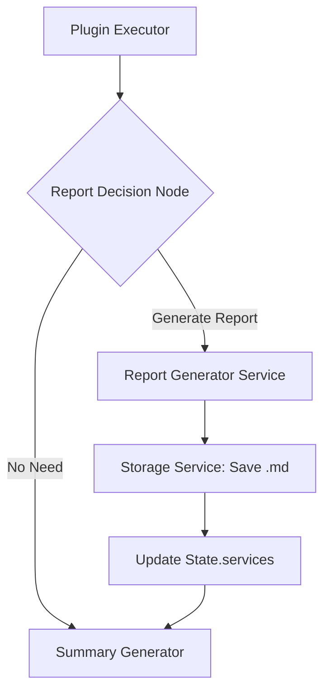

# 报告生成系统重构规划 (Report Generation Refactoring Plan)

## 1. 背景与目标 (Background & Objectives)

### 1.1 现状分析
当前报告生成功能作为 `Plugin Executor` 的一个普通步骤执行。这种设计存在以下局限性：
*   **上下文传递脆弱**：依赖占位符解析（Placeholder Resolver）在步骤间传递数据，容易因字段名不匹配导致解析失败。
*   **缺乏决策智能**：无论用户需求简单与否，只要规划中包含报告步骤，系统就会强制执行，造成资源浪费。
*   **职责边界模糊**：报告生成涉及“决策是否生成”、“内容合成”和“文件存储”三个逻辑，目前耦合在 Executor 中。

### 1.2 重构目标
*   **架构提升**：将报告生成从“工具执行层”提升至“工作流编排层”，与 `SummaryGenerator` 处于同一层级。
*   **动态决策**：引入 `ReportDecisionNode`，由 LLM 根据执行结果和用户意图动态判断是否需要生成详细报告。
*   **LLM 原生驱动**：彻底移除中间层的 Executor，由 LLM 直接完成从结构化 JSON 到 Markdown 的自然语言转换。
*   **全局视野**：报告节点可以访问 LangGraph 的全局状态（State），聚合所有前置步骤的分析结果。

---

## 2. 架构设计方案 (Architecture Design)

### 2.1 核心组件变更

| 组件名称 | 变更类型 | 描述 |
| :--- | :--- | :--- |
| `ReportGenerator.ts` | **新增** | 位于 `llm-interaction/workflow/`，负责调用 LLM 生成 Markdown 字符串。 |
| `ReportDecisionNode.ts` | **新增** | 位于 `llm-interaction/workflow/nodes/`，负责决策并协调报告生成与存储。 |
| `MarkdownReportGeneratorExecutor.ts` | **删除** | 旧的执行器实现将被彻底移除。 |
| `report_generator` Plugin | **废弃** | 从插件注册表和 Task Planner 的候选列表中移除。 |
| `GeoAIGraph.ts` | **修改** | 增加条件分支逻辑，串联新的报告生成流程。 |

### 2.2 新工作流路径

---

## 3. 实施路线图 (Implementation Roadmap)

### 第一阶段：后端核心逻辑重构 (Backend Core)

#### 3.1 创建 `ReportGenerator.ts`
*   **位置**：`server/src/llm-interaction/workflow/ReportGenerator.ts`
*   **功能**：
    *   接收 `AnalysisResult[]` 和 `UserQuery`。
    *   加载 `workspace/llm/prompts/en-US/report-generation.md`。
    *   调用 `LLMAdapterFactory` 生成 Markdown 内容。
    *   **关键点**：该文件只负责“生成文本”，不负责“保存文件”。

#### 3.2 实现 `ReportDecisionNode`
*   **位置**：`server/src/llm-interaction/workflow/nodes/ReportDecisionNode.ts`
*   **功能**：
    1.  **决策**：检查 `state.results` 是否有实质性数据，或用户是否明确要求“生成报告”。
    2.  **执行**：若需要，调用 `ReportGenerator`。
    3.  **持久化**：利用 `WorkspaceManager` 将生成的 Markdown 保存到 `workspace/results/reports/`。
    4.  **服务化**：构造一个 `type: 'report'` 的 `VisualizationService` 对象并存入 `state.services`。

#### 3.3 更新 `GeoAIGraph.ts`
*   在 `pluginExecutor` 之后、`summaryGenerator` 之前插入 `reportDecisionNode`。
*   使用 LangGraph 的 `addConditionalEdges` 实现动态跳转。

### 第二阶段：清理与解耦 (Cleanup & Decoupling)

#### 3.4 删除旧代码
*   删除目录：`server/src/plugin-orchestration/executor/reporting/`。
*   更新 `server/src/plugin-orchestration/config/executor-config.ts`，移除 `report_generator` 配置。
*   更新 `server/src/plugin-orchestration/registration/registerExecutors.ts`。

#### 3.5 优化 `ServicePublisher.ts`
*   确保 `determineServiceType` 能正确识别 `report` 类型。
*   确保生成的 URL 指向正确的 `.md` 文件路径。

---

## 4. 前端同步修改规划 (Frontend Synchronization)

### 4.1 消息渲染增强 (`MessageBubble.vue`)
*   **UI 适配**：为 `service.type === 'report'` 增加专属卡片样式（如 📄 图标）。
*   **预览交互**：点击卡片时，通过 Modal 弹窗展示 Markdown 渲染后的内容，而非直接下载。

### 4.2 状态管理 (`chatStore.ts`)
*   确保 SSE 接收到的 `report` 服务能被正确存入 `services` 数组。
*   增加 `activeReportUrl` 状态，支持用户在聊天过程中随时回看报告。

### 4.3 进度反馈
*   当后端进入 `ReportDecisionNode` 时，前端可显示“正在评估报告需求...”的微提示，增强 AI 决策的透明度。

---

## 5. 风险与应对 (Risks & Mitigation)

| 风险点 | 应对策略 |
| :--- | :--- |
| **Token 溢出** | 在传给 LLM 前，对 `AnalysisResult` 进行精简，仅保留统计元数据，剔除原始 GeoJSON 坐标。 |
| **LLM 决策失误** | 在 Prompt 中提供 Few-Shot 示例，明确界定“简单查询”与“复杂分析”的边界。 |
| **文件路径冲突** | 使用 `Date.now()` + `UUID` 生成唯一的报告文件名。 |

---

## 6. 总结 (Conclusion)

本次重构将使 GeoAI-UP 的报告生成功能从“机械执行”进化为“智能产出”。通过将决策权交给 LLM 并提升其在工作流中的层级，系统将能够提供更符合用户预期、内容更精准的分析报告。
