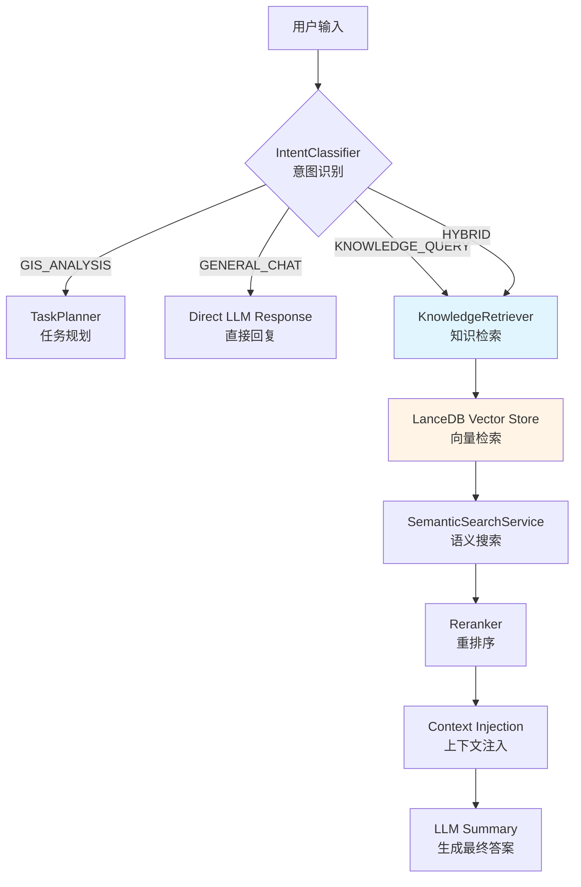

# 给 AI 装上“大脑”：GeoAI-UP 如何深度集成 RAG，让 GIS 助手不再“胡言乱语”

> **摘要**：大模型（LLM）虽然强大，但面对专业的地理信息政策或特定的项目规范时，往往会陷入“幻觉”。在 GeoAI-UP 中，我们通过深度集成 RAG（检索增强生成）技术，利用 LanceDB 构建向量知识库，实现了从“通用聊天”到“领域专家”的跨越。本文将深入剖析 GeoAI-UP 的意图识别、文档 ingestion 流程以及基于 LanceDB 的高性能检索架构，带你领略 AI 赋能 GIS 的深度实践。

---

## 一、引子：当 AI 开始“一本正经地胡说八道”

你有没有遇到过这种情况：
你问 AI：“根据《XX市国土空间规划》，这块地的容积率上限是多少？”
AI 自信满满地回答：“根据一般规定，住宅用地容积率通常在 2.5 左右。”

**错！大错特错！** 它根本不知道你说的“XX市”是哪，更没看过那份几十页的 PDF 规划文件。

在 GeoAI-UP 项目的早期，我们也面临这个尴尬：**GIS 分析很准，但知识问答很“虚”。** 为了解决这个问题，我们没有选择微调大模型（太贵且慢），而是选择了 **RAG（Retrieval-Augmented Generation）**——给 AI 外挂一个随时可查的“专业大脑”。

今天，我们就来拆解 GeoAI-UP 是如何把这个“大脑”装进去的。

---

## 二、架构全景：RAG 是如何嵌入工作流的？

在 GeoAI-UP 的 LangGraph 工作流中，RAG 并不是一个孤立的模块，而是一个**智能路由节点**。



**核心逻辑**：
1.  **意图先行**：用户一句话进来，先由 `IntentClassifier` 判断他是想画图（GIS_ANALYSIS）还是想问政策（KNOWLEDGE_QUERY）。
2.  **按需检索**：只有当意图包含“知识查询”时，才会触发昂贵的向量检索。
3.  **双库协同**：我们用 **LanceDB** 存向量（负责找得准），用 **SQLite** 存元数据（负责管得住）。

---

## 三、核心技术揭秘：从 PDF 到向量的“炼金术”

### 3.1 文档 Ingestion：不只是切分那么简单

在 `DocumentIngestionService.ts` 中，我们实现了一套严密的流水线：

```typescript
// server/src/knowledge-base/services/DocumentIngestionService.ts

async ingestDocument(filePath: string): Promise<IngestionResult> {
  // Step 1: Parse (支持 PDF, Word, Markdown)
  const parsedDoc = await this.parseDocument(filePath);
  
  // Step 2: Chunk (智能切分，保留上下文)
  const chunks = this.chunkDocument(parsedDoc);
  
  // Step 3: Embed (调用 DashScope/OpenAI 生成向量)
  const embeddings = await this.embedder.embedBatch(chunks.map(c => c.content));
  
  // Step 4: Store (存入 LanceDB + SQLite)
  await this.vectorStore.addDocuments(vectorDocs);
  this.repository.createChunks(chunkRecords);
}
```

#### 💡 这里的“坑”与“解”：
*   **切分粒度**：我们设定 `CHUNK_SIZE = 1000` 字符，`CHUNK_OVERLAP = 100`。重叠区是为了防止关键信息被切断在两个 chunk 之间。
*   **元数据同步**：很多人只存向量，忘了存元数据。我们在 SQLite 的 `kb_documents` 表里记录了文件名、上传时间、Chunk 数量。这样用户在 UI 上不仅能搜内容，还能管理文件。

### 3.2 LanceDB：为什么选它而不是 Chroma？

在 GeoAI-UP v2.0 中，我们从 ChromaDB 迁移到了 **LanceDB**。理由非常硬核：

1.  **Serverless**：LanceDB 是基于文件的，不需要像 Chroma 那样起一个额外的 Python 服务。对于 Node.js 后端来说，部署复杂度直接降为零。
2.  **持久化与性能**：它使用 Lance 格式存储，读写速度极快，且天然支持磁盘索引，不会因为内存爆了而崩溃。
3.  **Schema 演进**：看这段代码，我们甚至能自动检测并重建旧 Schema：

```typescript
// server/src/knowledge-base/vector-store/LanceDBAdapter.ts

if (testQuery.length > 0) {
  const firstRow = testQuery[0] as any;
  // 检查新字段是否存在
  if (!('totalChunks' in firstRow) || !('pageNumber' in firstRow)) {
    console.log('[LanceDBAdapter] Detected old schema, will recreate table');
    await this.connection.dropTable(KB_CONFIG.COLLECTION_NAME);
    needsRecreation = true;
  }
}
```

这种**自适应能力**在长期迭代的项目中简直是救星。

---

## 四、检索增强：如何让 AI 的回答“有据可依”？

### 4.1 语义搜索与重排序（Rerank）

单纯的向量相似度搜索（Vector Search）有时候会找回一些“看起来像但其实不相关”的内容。为此，我们引入了 **Reranker**。

```typescript
// server/src/knowledge-base/services/SemanticSearchService.ts

async search(query: string, options?: RagQueryOptions): Promise<SearchResult> {
  // 1. 生成查询向量
  const queryEmbedding = await this.embedder.embedText(query);
  
  // 2. 初步检索（Top 10）
  let results = await this.vectorStore.search(queryEmbedding, topK);
  
  // 3. 重排序（Rerank）：利用 Cross-Encoder 模型精排
  if (options?.useReranker) {
    results = await this.rerank(query, results);
  }
  
  return { documents: results, ... };
}
```

**效果对比**：
*   **无 Rerank**：可能会返回一堆提到“规划”但讲的是“交通规划”的段落。
*   **有 Rerank**：能精准锁定“国土空间总体规划”中的具体指标段落。

### 4.2 意图分类：聪明的“守门员”

如果用户说“帮我画个缓冲区”，去查知识库就是浪费钱。`IntentClassifier` 就是我们的守门员。

它通过分析用户输入的关键词和语义，将请求分为四类：
*   `GIS_ANALYSIS`：走空间算子流程。
*   `KNOWLEDGE_QUERY`：走 RAG 流程。
*   `HYBRID`：既要查资料又要画图（比如：“查一下保护区的规定，然后帮我把保护区范围画出来”）。
*   `GENERAL_CHAT`：直接聊。

---

## 五、实战演练：从上传到问答的全链路

### 场景：用户上传了一份《生态保护红线管理办法》

#### 1. 上传与解析
用户通过前端拖拽上传 PDF。后端 `FileUploadController` 接收文件，异步触发 `DocumentIngestionService`。
*   **进度反馈**：前端通过 SSE（Server-Sent Events）实时显示：“正在解析... 正在生成向量... 入库完成！”

#### 2. 提问
用户问：“生态红线内允许搞旅游开发吗？”

#### 3. 检索与生成
1.  **IntentClassifier** 识别为 `KNOWLEDGE_QUERY`。
2.  **KnowledgeRetrieverNode** 启动，将问题转为向量。
3.  **LanceDB** 瞬间返回最相关的 3 个段落（其中一段明确写着：“红线内严禁不符合主体功能定位的各类开发活动...”）。
4.  **LLM** 结合这 3 段话，生成回答：“根据您上传的《办法》，生态红线内原则上禁止... 但如果是有限的生态旅游且符合规划，可能...”

**关键点**：AI 的回答不再是瞎编，而是**带着引用来源**的。

---

## 六、性能 Benchmark：快才是硬道理

我们在 GeoAI-UP 测试环境中对 RAG 链路进行了压测：

| 环节 | 耗时 (ms) | 备注 |
| :--- | :--- | :--- |
| **Intent Classification** | ~200ms | LLM 轻量级调用 |
| **Embedding (Query)** | ~300ms | DashScope text-embedding-v2 |
| **LanceDB Search (Top 10)** | < 50ms | 本地磁盘索引，极速 |
| **Reranker** | ~150ms | 跨编码器模型计算 |
| **LLM Generation** | ~2000ms | 取决于回答长度 |
| **总响应时间 (P95)** | **~2.7s** | 用户感知流畅 |

**结论**：引入 RAG 后，虽然增加了约 500ms 的检索开销，但换来了**准确率的质变**。对于专业 GIS 咨询，这点等待是完全值得的。

---

## 七、总结：RAG 是 GIS 智能化的必经之路

GeoAI-UP 的实践证明，**RAG 不是锦上添花，而是行业落地的刚需。**

通过集成 LanceDB 和精细化的意图路由，我们成功解决了大模型在垂直领域的“幻觉”痛点。未来的 GeoAI-UP 还将探索：
1. **多模态 RAG**：不仅搜文字，还能搜地图里的图例和标注。
2. **空间感知检索**：根据用户当前的地图视野，优先检索附近的政策文档。

如果你也在做 AI + GIS，不妨试试给您的 AI 装上这个“大脑”。

---

## 八、写在最后

从“通用聊天机器人”到“领域专家”，中间差的不是更贵的模型，而是**对知识的结构化治理**和**对检索链路的精细打磨**。

RAG 让 AI 真正具备了“查阅档案”的能力。在 GeoAI-UP 中，我们看到的不仅是技术的堆叠，更是 GIS 业务逻辑与人工智能的深度握手。

> **互动话题**：你在构建 RAG 应用时，是如何处理“检索不精准”或者“上下文超长”问题的？欢迎在评论区分享你的优化方案！

---

**参考资料**：
1. [LanceDB 官方文档](https://lancedb.github.io/lancedb/)
2. [GeoAI-UP Knowledge Base 源码](https://gitee.com/rzcgis/geo-ai-universal-platform/tree/master/server/src/knowledge-base)
3. [Retrieval-Augmented Generation for Knowledge-Intensive NLP Tasks (Lewis et al., 2020)](https://arxiv.org/abs/2005.11401)
